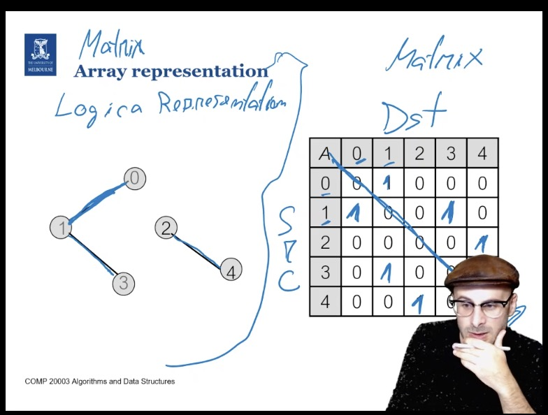
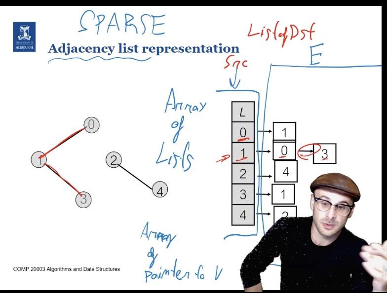

# GRAPHS AND TRAVERSALS
---
## GRAPHS

- a representation of a set of objects
- some pairs of objects are connected by links
- Graph G = {V,E}
	- Vertices V: can contain information
	- Edges E: Links between vertices, can have direction or weights.

- When compared to trees and linked lists:
	- Vertices = nodes
	- Edges = links

- Understanding the type of graph is really important, since it lets us decide what algorithm we can use to solve a given problem.


### TYPES OF GRAPHS

#### Undirected graph:

	We traverse the edges in both directions

1. Connected undirected graph
	- Every vertex can reach any other vertex

2. 	Unocnnected Undirected graph
	- Duh e.g. just four vertices without any edges

3. Unconnected graph with cycles
	- Connected in a circular way (we can keep traversing)

#### Directed graph

	Only one direction of traversal

1. Acyclic, unconnected directed graph (DAG)
	- Not all vertices are connected, one directio of traversal, and not cyclic

> Edges can have weights, these may indicate any property of the edge (e.g. the distance to the vertex).


- One of the problems with graphs is the reachability


2. Weakly connected, Directed graph
	- These are generated by removing the direction of the edges (making them undirected).
	- Done only when the reachability of the graph is low
	- Note that some graphs cannot become weakly connected if there no edges between the vertices

3. Strongly connected, Directed graph
	- We can reach one vertex from any other vertex

	
- Strongly connected components in a Digraph
	- Where the complete graph is not connected, but is connected through few components/vertices.
	
	
4. Bipartite graph:
	- U and V are disjoint sets of vertices
	- Every vertex in U connects to a vertex in V
	- But there is never a case where two vertices in the same set (U or V) connect (edge)
	- e.g. donors is one set and receivers is another.
	- e.g. matching for dating lmao


- Complete graphs
	- Every vertex is connected to every other vertex but not to itself
	- contains: $V(V-1)/2$ edges for undirected
	- contains $V(V-1)$ edges for directed

- Tree
	- Undirected
	- Acyclic
	- Property: Any two vertices are connected by exactly one simple path
		- Simple path: A path that doesnt traverse a vertex more than once.
		- e.g. you can get to a leaf from a root only one way in a tree, and you cant traverse it more than once (directed)

		
### CONSTRUCTING GRAPHS

1. Matrix/Array representation of graphs
	- represent the source vertices on the y axis and the destination vertices on the x axis
	- write a 1 in slots where there is an edge between the vertices, 0 otherwise

	


	- Graphs with weights on edges
		- Just put the weights instead of 1s and 0s
		- Non-existence of weights can be represented by -1 (since weight can be 0)
	
	- When we have a lot of slots filled we call it a dense graph (lot of edges)
	- There are other ways of representing a sparse graph.

2. Adjacency Representation
	- This representation is used to represent sparse graphs
	


- Complexity of the two representations to check if two vertices are connected
	1. Matrix/Array representation: $O(1)$
		- size for dense graph ($E = V(V-1)$) = $O(V^2)$
		- for sparse graph ($E = V$) = $O(V^2)$ 
	2. Adjacency representation: $O(x)$, where x = Max Degree of all pairs of vertices (the longest linked list)
		- size for dense graph = $O(V + E)$ = $O(V + V^2)$
		- for sparse graph = $O(V + V)$
	- Thus matrix is a bit better for dense graphs, and adjacency for sparse graphs


> $V * Degree(V) = E$

### Interesting graph problems

1. Reachability
2. Single Shortest path
3. Single source shortest path
4. All pairs shortes path
5. Travelling salesman problem
	- Given a set of vertices, we have to find a path which goes to every vertex and back to the origin without traversing a vertex more than once


P vs NP!!!

- the P subset of problems are polynomially solved by a turing machine
	- problems that take order $O(V) or O(V^2)$

- the NP subset of problems are run over a non-deterministic turing machine.
	- A non-deterministic turing machine is a machine that has multiple outcomes for a single operation.
	- this machine can be simulated but has not beem built (maybe with quantum computing) 

	
- a problem in NP translated to P would have a complexity translated to exponential.


- the best solution to the travelling salesman problem has a complexity of $O(1-999^n)$ where n is the number of vertices.


### DFS

#### DFS with trees

- In-order (ascending), Post-order, Pre-order: They all lead to the deepest node (leaf)

##### Iterative pre-order search: DFS

```

/* visits the deepest node */
void preorder(stack_t* st, node_t *t) {

	push(st,t);
	while(!stackempty(st)) {
		t = pop(st); visit(t);
		if(t->left != NULL) push(st, t->l);
		if(t->right !+ NULL) push(st, t->right);
	}
}
```

#### BFS with trees

- Instead of going down a branch, we go through all the parents of that level first.


##### Iterative BFS


```

/* just use a queue and DFS changes to BFS lmao */
/* visits the all the parent nodes at that level */
void preorder(queue* Q, node_t *t) {

	push(Q,t);
	while(!emptyQ(st)) {
		t = deQ(st); visit(t);
		if(t->left != NULL) enQ(Q, t->l);
		if(t->right !+ NULL) enQ(Q, t->right);
	}
}
```

- The above two assumes that every node is reachable and every node has only one parent and can only be visited once.
- But this is not the case for graphs
	- We need to ensure that every node is reached
	- Need to ensure that every node is visited only once
- This is accomplished by:
	- Marking each node as visited
	- Also keep track of the order of visit

	
```

/* adjacency list is an array of pointers to nodes; node is struct with value (nodeID) and next ptr */

struct node {

	int value;
	struct node *next;
};
struct node* ajd[V];


int visited[V];
int order = 0;

void visitDFS(int k) { /* k = vertex index */

	struct node* t;
	visited[k] = ++order;
	for(t = adj[k]; t != NULL; t = t->next) {
		if(!visited[t->v]) visitDFS(t->v);
	}
}


```